# Deckarium — coleção de Magic e oficina de decks

Projeto local para pesquisar cartas, planejar decks de Commander a partir da sua coleção, compartilhar decks e coleções e manter um cache de imagens sem precisar baixar todas as impressões do Scryfall.

## Capturas

<table>
<tr><td width="50%"><a href="docs/images/comandantes.png">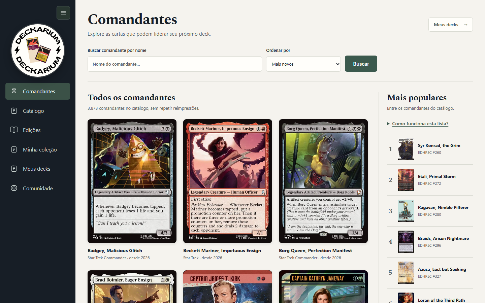</a><br><b>Comandantes</b><br><sub>Todos os comandantes do catálogo, dos mais novos aos mais populares no EDHREC.</sub></td><td width="50%"><a href="docs/images/catalogo.png">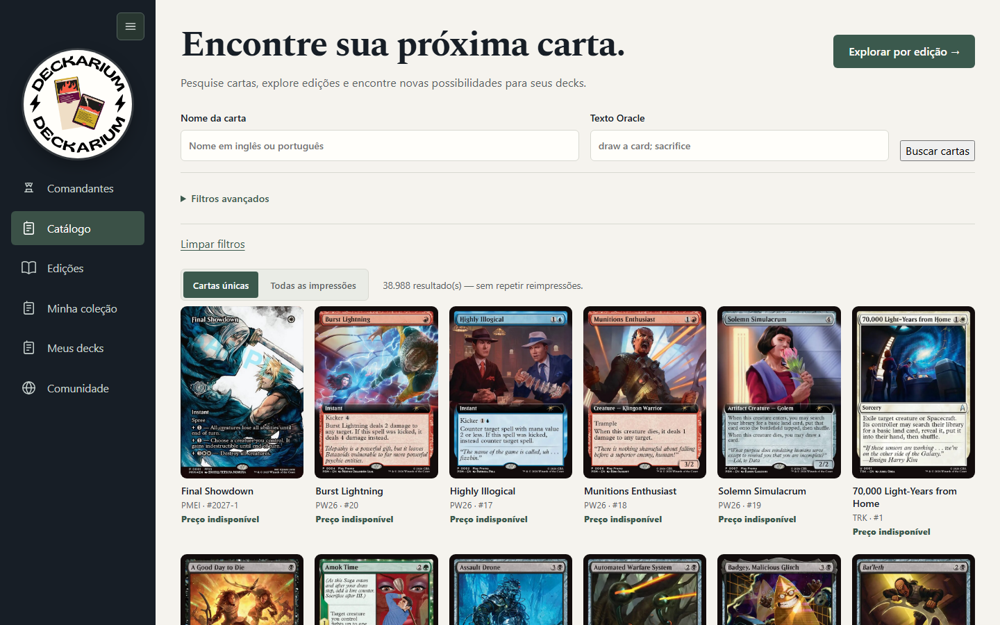</a><br><b>Catálogo</b><br><sub>Busca e filtros sobre todas as cartas, uma impressão por carta.</sub></td></tr>
<tr><td width="50%"><a href="docs/images/edicoes.png">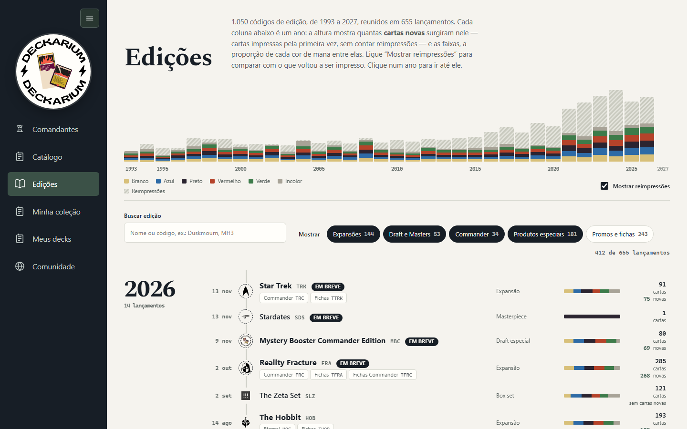</a><br><b>Edições</b><br><sub>Linha do tempo com cartas novas por ano e, opcionalmente, as reimpressões.</sub></td><td width="50%"><a href="docs/images/edicao.png">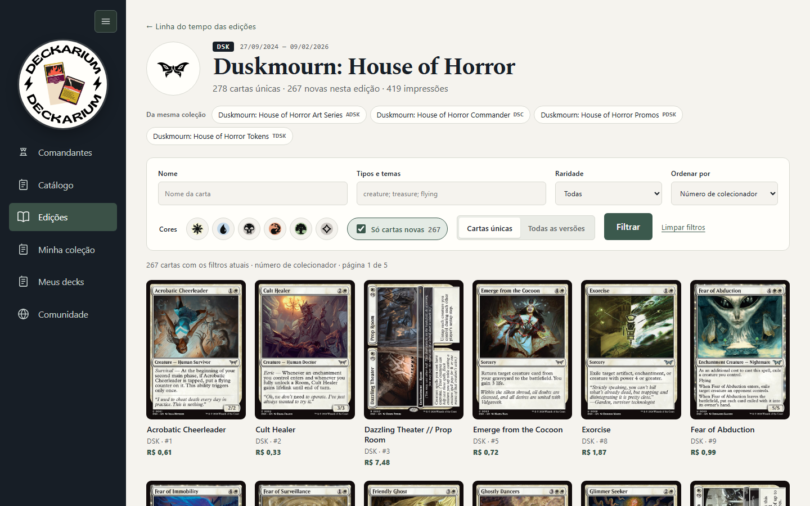</a><br><b>Página da edição</b><br><sub>Filtros, contagem de cartas novas e “Só cartas novas”.</sub></td></tr>
<tr><td width="50%"><a href="docs/images/colecao.png">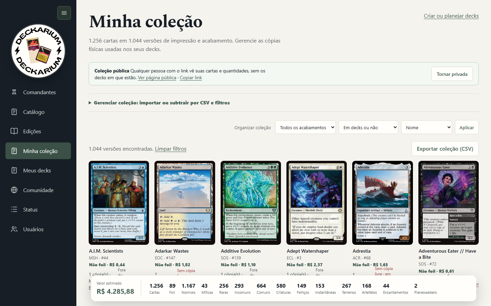</a><br><b>Minha coleção</b><br><sub>Cópias, acabamentos, uso em decks e resumo de valor.</sub></td><td width="50%"><a href="docs/images/decks.png">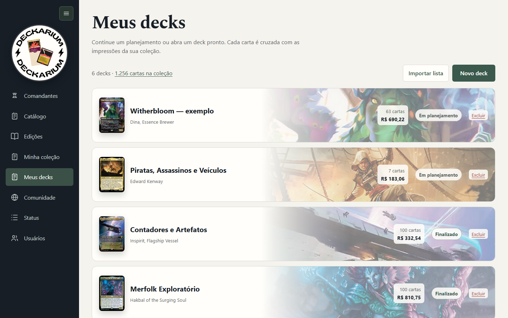</a><br><b>Meus decks</b><br><sub>Biblioteca de decks com a ilustração da comandante.</sub></td></tr>
<tr><td width="50%"><a href="docs/images/deck-visao-geral.png">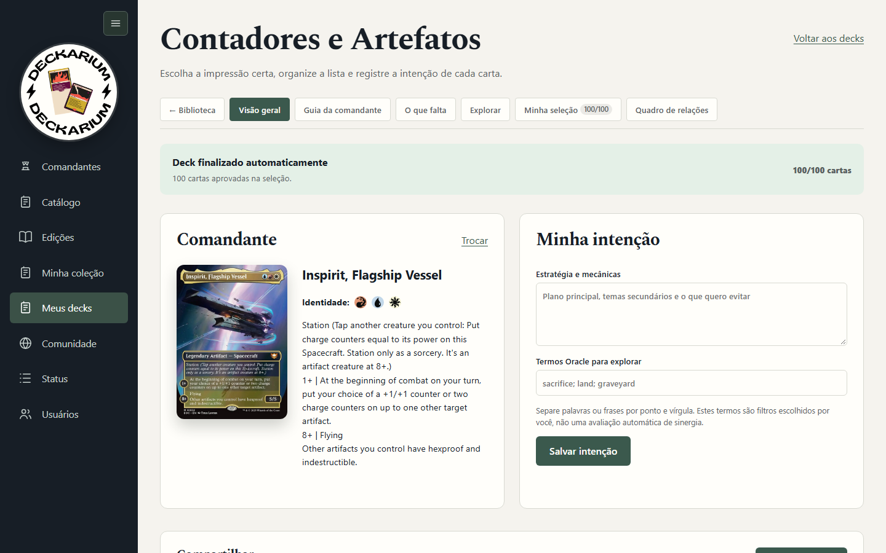</a><br><b>Visão geral do deck</b><br><sub>Comandante, intenção e atalhos para as subpáginas.</sub></td><td width="50%"><a href="docs/images/explorar.png">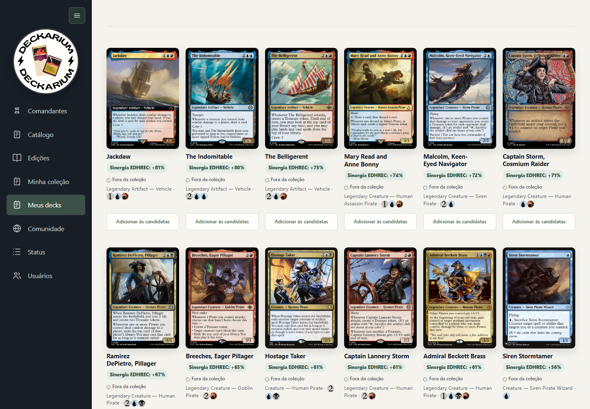</a><br><b>Explorar</b><br><sub>Resultados ordenados por sinergia EDHREC, com situação na coleção.</sub></td></tr>
<tr><td width="50%"><a href="docs/images/selecao-cartas-grandes.png">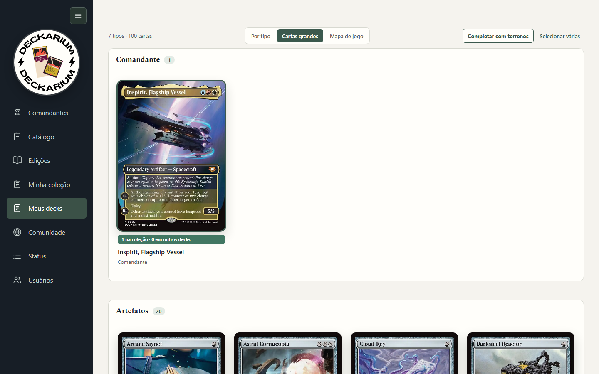</a><br><b>Minha seleção · Cartas grandes</b><br><sub>Cartas em tamanho de leitura; informações abaixo da arte.</sub></td><td width="50%"><a href="docs/images/mapa-de-jogo.png">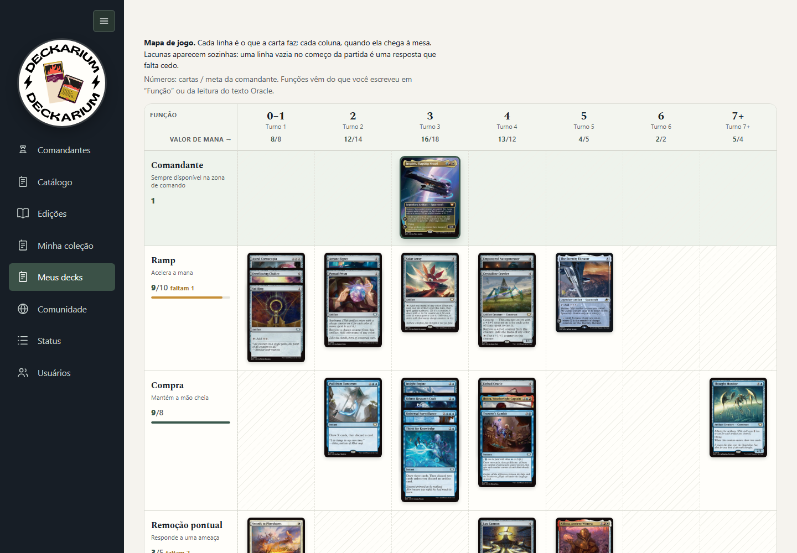</a><br><b>Minha seleção · Mapa de jogo</b><br><sub>Função × valor de mana, com metas por linha e por coluna.</sub></td></tr>
<tr><td width="50%"><a href="docs/images/fichas.png">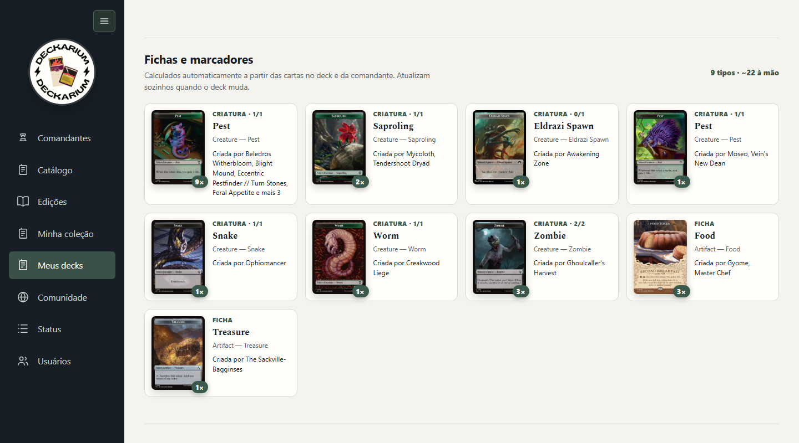</a><br><b>Fichas e marcadores</b><br><sub>Calculados automaticamente das cartas do deck.</sub></td><td width="50%"><a href="docs/images/terrenos.png">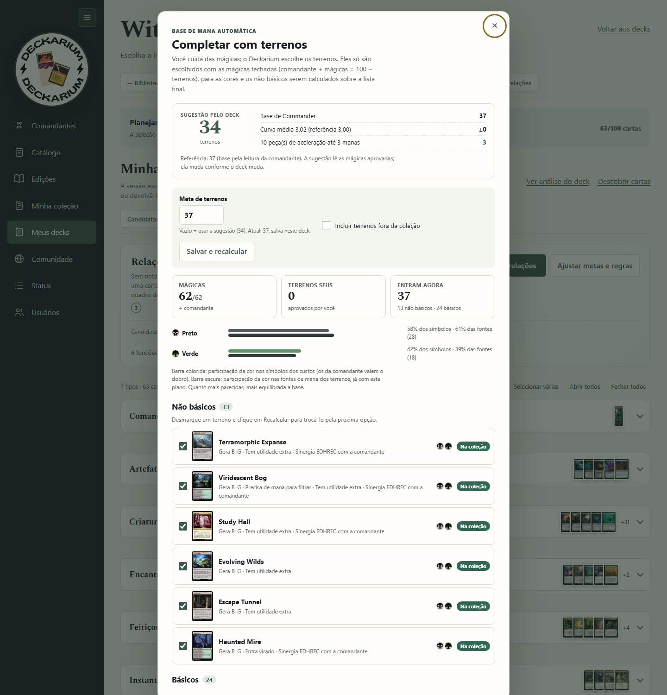</a><br><b>Completar com terrenos</b><br><sub>Sugestão de quantidade pelo deck, não básicos da coleção e básicos pelas cores.</sub></td></tr>
<tr><td width="50%"><a href="docs/images/analise.png">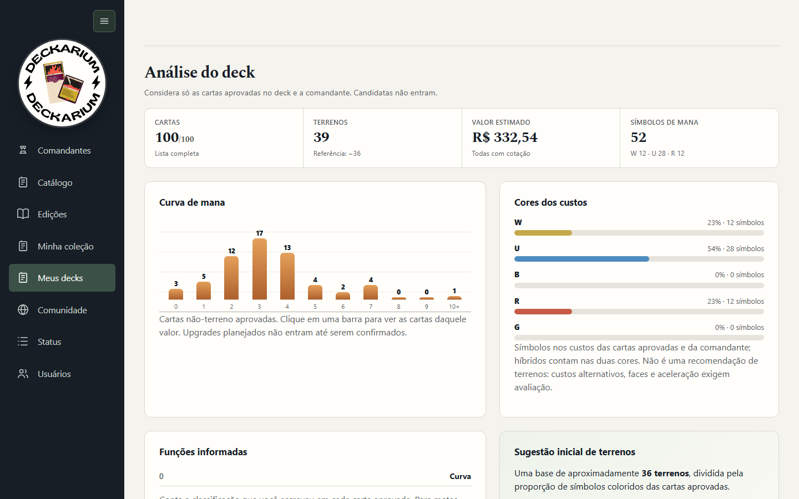</a><br><b>Análise do deck</b><br><sub>Contagens, valor, curva de mana e cores dos custos.</sub></td><td width="50%"><a href="docs/images/quadro.png">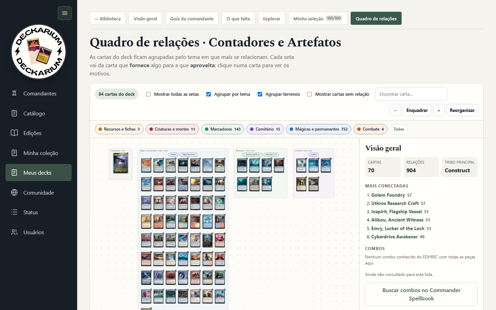</a><br><b>Quadro de relações</b><br><sub>Cartas agrupadas pelo tema e setas entre o que fornece e o que aproveita.</sub></td></tr>
</table>

## Documentação

- [Oficina de decks](docs/deck-builder.md) — decks, coleção, EDHREC, quadro de relações e compartilhamento.
- [Dicionário de dados](docs/banco-de-dados.md) — todas as tabelas e colunas do PostgreSQL.
- [Página inicial](docs/home.md) e [deploy](docs/deploy.md).

## Páginas

| Página | Rota | Acesso |
|---|---|---|
| Comandantes | `/commanders.php` | Todos |
| Catálogo | `/?catalog=1` | Todos |
| Edições | `/editions.php` | Todos |
| Comunidade | `/public.php` | Todos |
| Perfil de jogador | `/profile.php?u=usuario` | Todos (decks e coleção só se forem públicos) |
| Deck público | `/public_deck.php?id=ID` | Todos, se o deck for público |
| Coleção pública | `/public_collection.php?u=usuario` | Todos, se a coleção for pública |
| Minha coleção | `/collection.php` | Login |
| Meus decks | `/decks.php` | Login |
| Status do acervo | `/status.php` | Administrador |
| Histórico de atualizações | `/sync_history.php` | Administrador |
| Usuários | `/users.php` | Administrador |

A navegação lateral pode ser recolhida; o botão fica sempre no topo. Em telas de até 850px ela vira uma barra superior com menu suspenso.

## Edições

`/editions.php` é uma linha do tempo de todos os lançamentos, em página única e sem paginação.

- **Espectrograma no topo:** uma coluna por ano; a altura é o número de **cartas novas** daquele ano — cartas impressas pela primeira vez, sem reimpressões (cada carta conta uma vez; sem fichas e sem cartas só digitais) — e as faixas mostram a proporção de cada cor de mana entre elas. “Mostrar reimpressões” acrescenta, hachuradas, as cartas que voltaram a ser impressas no ano (escolha lembrada no navegador). Ao rolar, ele vira uma régua compacta presa no topo, com os anos de 5 em 5 e o ano visível destacado; a diferença de altura vira margem, então o conteúdo não pula e a régua não fica alternando.
- **Primeira impressão:** a carta é nova na edição onde foi impressa primeiro; no mesmo dia, a edição principal vence Commander, produtos especiais e promos (ex.: DSK antes de DSC e PDSK). Regra única em `editionFirstPrintingSql()` (`functions.php`), usada pela linha do tempo e pela página da edição.
- **Uma linha por lançamento:** os códigos de edição são agrupados pela coleção que as pessoas reconhecem (`editionUmbrella()`); subedições como Commander, fichas, promos e série de arte aparecem como marcas na linha da coleção-mãe (ex.: Duskmourn com ADSK, DSC, PDSK e TDSK). Cada linha traz data, símbolo da edição sobre a linha do tempo, tipo, faixa de cores das cartas da edição e total de cartas; lançamentos futuros aparecem como “Em breve”.
- **Cada lançamento** mostra o total de cartas e quantas são **novas** (link direto para elas).
- **Busca e filtros instantâneos** por nome ou código e por categoria (Expansões, Draft e Masters, Commander, Produtos especiais, Promos e fichas). Promos e fichas soltos começam ocultos; a escolha fica lembrada no navegador.
- Edições sem símbolo no Scryfall (ex.: Secret Lair Drop) mostram o logo do Deckarium no lugar.
- **Página de uma edição** (`/edition.php?set=CODIGO`): símbolo, datas, links para os outros códigos da mesma coleção e filtros por nome, tipos e temas, raridade (com contagem), cores e **Só cartas novas** (`&new=1`, com a contagem no cabeçalho), com ordenação por número de colecionador, nome, raridade, valor de mana, preço ou cor, em cartas únicas ou todas as versões (60 por página; filtros preservados na paginação).
- Os dados vêm de duas consultas agregadas sobre `cards`, guardadas por `catalogCached` por até 24 horas e renovadas a cada sincronização do catálogo. Estilos e script próprios: `assets/editions.css` e `assets/editions.js`.

## Comandantes

`/commanders.php` lista **todos** os comandantes do catálogo, 24 por página, sem repetir reimpressões. A ordem padrão é **Mais novos**, pela data da **primeira** impressão de cada carta (uma reimpressão não torna um comandante antigo “novo”). Também há **Mais populares** (posição no EDHREC), **Nome (A–Z)** e **Adicionados recentemente**. A busca por nome percorre o catálogo inteiro. Cartas só digitais (Alchemy/Arena) ficam de fora. A coluna lateral mostra os mais populares.

## Mudança principal da v4

O banco continua podendo guardar **todas as impressões** (`default_cards`), mas a aplicação trata duas coisas separadamente:

- **Carta lógica**: identificada pelo `oracle_id`.
- **Impressão**: identificada pelo `id` do Scryfall, com set, collector number e arte próprios.

Assim uma carta como `Command Tower`, que possui muitas reimpressões, continua com todas as versões no PostgreSQL, mas a listagem padrão mostra apenas **uma**. Na página da carta há uma seção **Outras impressões** para trocar de edição.

## Imagens: não baixe tudo

A v4 usa cache sob demanda:

- listagens e upgrades pedem imagem `small`;
- a imagem é baixada somente quando aparece na tela;
- a página de detalhes pede `normal` somente quando você abre aquela carta;
- reprints não são baixados automaticamente.

Isso evita baixar mais de 100 mil imagens normais sem necessidade.

## Iniciar

```bash
cp .env.example .env  # se existir no seu diretório
docker compose up -d --build
```

Site:

```text
http://localhost:8080
```

PostgreSQL:

```text
localhost:5435
```

## Sincronizar dados

Para manter todas as impressões no banco:

```bash
docker compose exec app php bin/sync_scryfall.php default_cards
```

O banco pode ter mais de 100 mil linhas; isso não significa que você precise baixar a imagem de cada linha.

Ao terminar, a sincronização roda `bin/warm_caches.php`, que prepara os caches pesados (índice de funções usado em Meus decks, linha do tempo das Edições, listas de edições dos filtros) para a primeira visita não esperar por eles. O cache de consultas fica em `/tmp`, um arquivo por usuário do sistema; rodando como root, o script passa a `www-data`. Para aquecer manualmente:

```bash
docker compose exec app php bin/warm_caches.php
```

Confira a relação entre impressões e cartas únicas:

```bash
docker compose exec db psql -U mtg -d mtg -c "SELECT count(*) AS impressoes, count(DISTINCT COALESCE(oracle_id,id)) AS cartas_unicas FROM cards;"
```

## Atualização automática (cron)

O container tem um cron próprio: **todos os dias às 06:10 e 18:10** ele roda `bin/auto_update.php`, que consulta o manifesto do Scryfall e compara com a última importação local. Sem publicação nova, nada é baixado. Havendo, ele importa o catálogo (`bin/sync_scryfall.php`) e, em seguida, baixa as imagens em tamanho normal (`bin/download_images.php`) — retomável, preservando o que já está no disco.

Cada execução vira uma linha de `auto_update_runs` e aparece em **Status → Atualização automática**: horário da próxima verificação, resultado da última, cartas novas, imagens baixadas e o histórico completo com duração e link para as cartas adicionadas. O painel se atualiza sozinho enquanto a rotina trabalha; o progresso detalhado continua nos painéis de catálogo e de imagens logo abaixo. O botão **Executar agora** dispara a mesma rotina fora do horário (registrada como `manual`).

Tudo é controlado por ambiente (veja `.env.example`); o entrypoint do container monta o crontab a partir desses valores:

| Variável | Padrão | Para que serve |
| --- | --- | --- |
| `AUTO_UPDATE_ENABLED` | `1` | `0` desliga o cron (a página passa a mostrar "Desligada"). |
| `AUTO_UPDATE_TIMES` | `06:10,18:10` | Horários `HH:MM` separados por vírgula. |
| `AUTO_UPDATE_IMAGE_MODE` | `all` | `all` (todas as impressões) ou `unique` (uma por carta lógica). |
| `AUTO_UPDATE_IMAGE_CONCURRENCY` | `4` | Downloads simultâneos de imagem. |
| `TZ` | `America/Sao_Paulo` | Fuso do cron e do PHP — os horários acima seguem ele. |

A saída fica em `storage/auto-update.log`. Uma trava (`storage/auto-update.lock`) impede duas rotinas ao mesmo tempo; se uma sincronização ou um download manual já estiver rodando, a execução é registrada como *adiada* e o próximo horário tenta de novo. Para rodar na mão:

```bash
docker compose exec app php bin/auto_update.php
```

Opções: `--force` (importa mesmo sem publicação nova), `--no-images` (só o catálogo), `--mode=unique|all` e `--source=manual`.

## Downloader rápido e deduplicado

Novo formato:

```bash
php bin/download_images.php MODO TAMANHO CONCORRENCIA [LIMITE]
```

### Recomendado

Uma imagem pequena por carta lógica, sem repetir reprints, com 8 downloads simultâneos:

```bash
docker compose exec app php bin/download_images.php unique small 8
```

Somente as cartas da página de upgrades:

```bash
docker compose exec app php bin/download_images.php upgrades small 8
```

Primeiras 5000 cartas únicas em tamanho normal:

```bash
docker compose exec app php bin/download_images.php unique normal 8 5000
```

### Não recomendado

Todas as impressões em tamanho normal:

```bash
docker compose exec app php bin/download_images.php all normal 8
```

Esse último modo é justamente o que pode gerar dezenas de milhares de downloads redundantes.

## O que acontece com imagens já baixadas

Nada é perdido. A v4 continua entendendo `local_image` e `local_image_back` do projeto anterior. O novo cache de thumbnails fica em:

```text
storage/images/small/
```

Imagens normais novas ficam em:

```text
storage/images/normal/
```

## Reprints na interface

Na página principal há duas opções:

- **Cartas únicas** — agrupa por `oracle_id`.
- **Todas as impressões** — mostra cada impressão separadamente.

Na página de detalhes, `card.php`, todas as impressões com o mesmo `oracle_id` aparecem em **Outras impressões**. Ao escolher outra edição, o `id` exato daquela impressão é usado e a arte correspondente é cacheada apenas se for aberta.

## Estratégia recomendada

Para este projeto, eu usaria:

1. `default_cards` no PostgreSQL para manter metadados de todas as impressões.
2. Interface em modo `Cartas únicas` por padrão.
3. Cache `small` automático durante a navegação.
4. `normal` apenas na página de detalhes.
5. Downloader `unique small 8` somente se você quiser um cache offline mais abrangente.

Isso preserva a informação completa sobre reprints sem pagar o custo de armazenamento e tempo de baixar a mesma carta dezenas de vezes.

## v5 — downloader com uso constante de memoria

Se `unique small` estourar `memory_limit=256M`, use a versao v5 do `app/bin/download_images.php`.
Ela nao usa `fetchAll()`, nao traz o JSON `raw` inteiro para o PHP e grava os downloads direto em arquivos `.part`.

```bash
docker compose exec app php bin/download_images.php unique small 8
```

Para testar primeiro com 1000 cartas:

```bash
docker compose exec app php bin/download_images.php unique small 8 1000
```

A execucao e retomavel: imagens existentes sao ignoradas.

## v6 — lançamentos recentes e navegação por edição

A página inicial agora possui duas áreas novas:

- **Cards lançados recentemente**: usa a primeira data de lançamento de cada `oracle_id`, então reimpressões antigas em sets novos não ocupam a lista de cartas realmente novas.
- **Edições recentes**: atalhos para os sets mais novos importados no banco.

Também foram adicionadas:

- `http://localhost:8080/editions.php` — linha do tempo de todas as edições (veja a seção **Edições** acima).
- `http://localhost:8080/edition.php?set=eoc` — cartas de uma edição específica.

Na página de uma edição, o modo padrão agrupa variantes/reprints internos pelo `oracle_id`. Use **Todas as versões** para ver showcase, borderless e outras impressões separadamente.

Não há alteração de schema nesta versão. Se o projeto já está rodando com os volumes `./app:/var/www/html`, basta substituir/adicionar os arquivos da pasta `app` e atualizar o navegador.

## v6.1 - correção PostgreSQL/PDO
Corrige a consulta da home que usava o operador JSONB `?`. O PDO PostgreSQL pode interpretar esse caractere como placeholder posicional (`$1`) quando `ATTR_EMULATE_PREPARES=false`. A consulta agora usa `jsonb_exists(...)`, evitando o conflito.

## Oficina de decks Commander

Novo módulo em http://localhost:8080/decks.php. Importação de coleção, busca Oracle e seleção manual de cartas. Consulte [o guia do módulo](docs/deck-builder.md).

## Idiomas

A interface fica em **português (BR)** ou **inglês**, com a troca no rodapé do menu lateral. A escolha vale para quem não tem conta (cookie de um ano) e fica salva na conta de quem entra (`users.locale`). Sem escolha, o Deckarium segue o idioma do navegador e, na dúvida, usa o português.

Os textos são traduzidos em `app/lang/en.php`, onde a chave é a própria frase em português: `'Comandantes' => 'Commanders'`. Assim, em português nada é procurado, e o que ainda não foi traduzido continua aparecendo em português em vez de sumir. Para traduzir uma tela nova, envolva o texto com `t()` (ou `te()`, que já escapa para HTML) e acrescente a frase ao dicionário. As telas públicas — navegação, catálogo, edições, comandantes, carta, entrar e criar conta — já estão traduzidas; as áreas de conta, decks e administração seguem em português.

## Guardar cartas direto do catálogo

No catálogo, nas edições, nos comandantes e na página da carta, cada carta tem o botão **Guardar**, com duas ações:

- **Na minha coleção:** guarda aquela impressão exata (edição e número), com quantidade e a opção foil, do mesmo jeito que o CSV do ManaBox registra.
- **Nas candidatas de um deck:** manda a carta para as candidatas. Só ficam liberados os decks cuja comandante aceita as cores da carta; os demais aparecem marcados como fora da identidade, com o motivo. Deck ainda sem comandante aceita qualquer carta.

## Lista de desejos

Em **Lista de desejos** ficam as cartas que você quer comprar, mesmo sem ter nenhuma cópia. No catálogo, nas edições, nos comandantes e na página da carta, o botão **Guardar** tem a opção **Salvar na lista**; a carta some da lista quando você escolhe **Tirar da lista**.

A página mostra o total estimado, quantas cartas já entraram na sua coleção (com selo na arte) e ordena por data, preço ou nome. A lista é privada e fica fora dos buscadores.

## Filtros e ordenação

Os filtros de todas as telas abrem numa janela, e o botão informa quantos estão ativos. Fora da janela ficam só os controles de uso constante: a ordenação e, na coleção, acabamento, uso em decks, importar e exportar.

O catálogo ordena por lançamento (mais novas ou mais antigas), nome e **preço**, maior ou menor primeiro. O preço da ordenação é o menor entre normal e foil, convertido em reais.

O idioma do site usa o parâmetro `hl` (`?hl=en`), e não `lang`, porque `lang` já filtra o idioma impresso na carta.

## Contas e acesso

O Deckarium tem contas de usuário. Qualquer visitante consulta o **catálogo**, as **edições**, os **comandantes** e a **Comunidade** (decks e coleções que os donos tornaram públicos); **Minha coleção**, **Meus decks** e **Upgrades** exigem login, e cada conta enxerga apenas os próprios dados. **Status** e **Usuários** são exclusivos de administradores (inclusive os endpoints de download e sincronização).

- **Criar conta:** `/register.php` — nome completo, nome de usuário, email e senha (mínimo de 10 caracteres).
- **Entrar:** `/login.php` — aceita usuário ou email; "Manter conectado" guarda a sessão por 30 dias (sem ele, 12 horas de inatividade).
- **Minha conta:** `/account.php` — altera nome, usuário, email e senha. Trocar a senha encerra as outras sessões.
- **Usuários (admin):** `/users.php` — promove/rebaixa administradores, desativa contas e gera senhas temporárias (não há envio de email para recuperar senha).
- **Proteções:** senhas com `password_hash`, sessão regenerada no login, CSRF em todos os formulários, bloqueio de 15 minutos após 8 tentativas erradas e cookies `HttpOnly`/`SameSite=Lax`.

Na primeira requisição após atualizar, o app cria as tabelas `users`, `auth_attempts` e `app_migrations`, cria um administrador padrão e transfere a coleção e os decks já existentes para ele. `builder_decks` e `builder_collection` passam a ter `user_id`.

**Administrador inicial.** Quando o banco ainda não tem nenhum usuário, o app cria uma conta de administrador:

- usuário `admin`, email `admin@deckarium.local` e nome `Administrador` — mude com `ADMIN_USERNAME`, `ADMIN_EMAIL` e `ADMIN_NAME` no `.env`;
- a senha vem de `ADMIN_PASSWORD`; se ela estiver vazia, o app gera uma senha aleatória e a grava em `storage/admin-inicial.txt` e no log (`docker compose logs app | grep administrador`). Entre, troque a senha em **Minha conta** e apague o arquivo;
- se existir `app/auth_bootstrap.php` (ignorado pelo Git, usado pelo deploy), ele tem prioridade sobre as variáveis.

Com usuários já cadastrados, nada disso é executado.

Para rodar os testes de fluxo, informe uma conta: `$env:DECKARIUM_USER='...'; $env:DECKARIUM_PASSWORD='...'; node tests/deck-workflow.mjs`.

## Guia rápido para rodar localmente

Pré-requisitos: Docker Desktop com Compose habilitado e Git. No PowerShell:

~~~powershell
git clone <url-do-repositorio>
cd mtg-local-scryfall
Copy-Item .env.example .env -ErrorAction SilentlyContinue
docker compose up -d --build
~~~

Abra http://localhost:8080. O PostgreSQL fica disponível em localhost:5435 para ferramentas externas; dentro do Compose, o host do banco é db.

Para importar ou atualizar o catálogo Scryfall, abra **Status → Catálogo do Scryfall** e clique em **Baixar atualização**. O download e a importação rodam em segundo plano, com progresso na própria página (log em `storage/sync.log`).

Cada sincronização registra as cartas que entraram no banco pela primeira vez (tabelas `sync_runs` e `sync_run_cards`). Em **Status → Cartas adicionadas → Ver histórico completo** (`/sync_history.php`) há, para cada execução, o total de cartas novas, o resumo por edição, busca, paginação de 100 em 100, a situação da imagem local de cada carta e a exportação da lista completa em CSV — pensada para atualizações com centenas de cartas. Execuções interrompidas mantêm o registro do que já foi importado. Pelo terminal, o comando continua disponível e aparece no mesmo painel:

~~~powershell
docker compose exec app php bin/sync_scryfall.php default_cards
~~~

Depois, em Minha coleção, importe um CSV com as colunas Name,Scryfall ID,Quantity. A coleção pode ser filtrada por uso em decks e exportada em CSV com os filtros ativos. Em Meus decks, crie um planejamento ou importe uma lista (com campo próprio para a comandante). Escolha a comandante antes de adicionar cartas às candidatas; a seleção segue candidatas → deck e finaliza automaticamente em 100 cartas.

Comandos úteis:

~~~powershell
docker compose ps
docker compose logs -f app
docker compose exec app php -l /var/www/html/decks.php
docker compose down
~~~

Os dados do PostgreSQL e as imagens ficam nos volumes/pastas configurados pelo docker-compose.yml. Não use docker compose down -v sem fazer backup, pois isso remove os volumes do banco.

O módulo de decks, sinergias do EDHREC, preços e fluxo de upgrades está documentado em [docs/deck-builder.md](docs/deck-builder.md).
