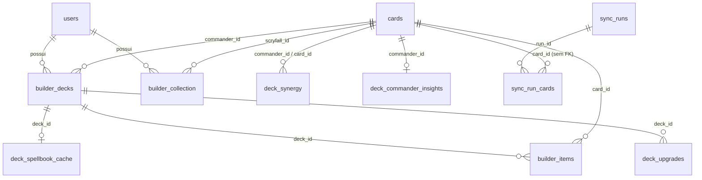

# Dicionário de dados

Banco PostgreSQL do Deckarium (schema `public`). Gerado a partir do banco em execução em 17/09/2026; mantenha este arquivo atualizado ao criar ou alterar tabelas.

## Visão geral

| Grupo | Tabelas | Quem cria |
|---|---|---|
| Catálogo Scryfall | `cards`, `sync_status`, `sync_runs`, `sync_run_cards`, `card_tags` | `database/init.sql`, `app/sync_log.php`, `app/bin/sync_tagger.php` |
| Contas e acesso | `users`, `auth_attempts`, `app_migrations` | `app/auth.php` (migração automática na primeira requisição) |
| Coleção e decks | `builder_collection`, `builder_decks`, `builder_items`, `deck_upgrades` | `deckSchema()` em `app/deck_library.php` e `app/auth.php` |
| Cache de fontes externas | `deck_synergy`, `deck_commander_insights`, `deck_spellbook_cache` | `deckSchema()` |
| Legado | `upgrade_items` | `database/init.sql` |

Não há ferramenta de migração: as tabelas novas usam `CREATE TABLE IF NOT EXISTS` e as colunas novas `ALTER TABLE … ADD COLUMN IF NOT EXISTS`, executados pelo próprio app. `database/init.sql` só roda na criação do volume do PostgreSQL.

### Conceitos usados em várias tabelas

- **Impressão**: uma linha de `cards`, identificada pelo `id` do Scryfall (UUID). Cada edição, arte, idioma e número de colecionador é uma impressão diferente.
- **Carta lógica**: o conjunto de impressões com o mesmo `oracle_id`. Nas consultas aparece como `COALESCE(oracle_id, id)`, porque algumas cartas (ex.: faces reversíveis) guardam o `oracle_id` só em `card_faces`.
- **Cópia livre**: cópias de uma carta lógica na coleção menos as usadas em decks (cartas aprovadas + comandantes). Candidatas não reservam cópias.

### Relacionamentos

`builder_collection.scryfall_id` e `sync_run_cards.card_id` não têm chave estrangeira: a coleção aceita impressões que ainda não estão no catálogo local, e o histórico continua válido se uma carta sair do catálogo.

---

## Catálogo Scryfall

### `cards`

Uma linha por impressão do Scryfall (`default_cards`, ~118 mil linhas). Preenchida por `app/bin/sync_scryfall.php` (upsert por `id`) e, para cartas avulsas buscadas por nome, por `upsertScryfallCard()` em `app/scryfall_local.php`.

| Coluna | Tipo | Nulo | Padrão | Descrição |
|---|---|---|---|---|
| `id` | uuid | não | | **PK.** ID da impressão no Scryfall. |
| `oracle_id` | uuid | sim | | Identidade da carta lógica. Nulo em alguns layouts; use `COALESCE(oracle_id, id)`. |
| `lang` | varchar | não | `'en'` | Idioma da impressão (`en`, `pt`, `ja`…). |
| `name` | text | não | | Nome impresso. Cartas de duas faces usam `Face A // Face B`. |
| `mana_cost` | text | sim | | Custo no formato `{2}{G}{G}`. |
| `cmc` | numeric | sim | | Valor de mana. |
| `type_line` | text | sim | | Linha de tipo completa. |
| `oracle_text` | text | sim | | Texto Oracle (em inglês). |
| `colors` | jsonb | não | `'[]'` | Cores da carta, ex.: `["B","G"]`. |
| `color_identity` | jsonb | não | `'[]'` | Identidade de cor para Commander. |
| `keywords` | jsonb | não | `'[]'` | Palavras-chave (Flying, Ward…). |
| `set_code` | varchar | sim | | Código da edição (`eoc`, `dsk`…). |
| `set_name` | text | sim | | Nome da edição. |
| `collector_number` | varchar | sim | | Número de colecionador (pode ter letras, ex.: `2027-1`, `123★`). |
| `rarity` | varchar | sim | | `common`, `uncommon`, `rare`, `mythic`, `special`, `bonus`. |
| `artist` | text | sim | | Artista. |
| `released_at` | date | sim | | Data de lançamento da impressão. |
| `layout` | varchar | sim | | Layout do Scryfall (`normal`, `transform`, `token`, `art_series`…). |
| `image_uri` | text | sim | | URL da imagem da frente no Scryfall. |
| `image_uri_back` | text | sim | | URL da imagem do verso, quando existe. |
| `local_image` | text | sim | | Caminho de imagem local do formato antigo (v3); mantido por compatibilidade. |
| `local_image_back` | text | sim | | Idem, verso. |
| `prices` | jsonb | não | `'{}'` | Preços do Scryfall (`usd`, `usd_foil`, `eur`, `eur_foil`…). Convertidos para BRL por `USD_BRL_RATE`/`EUR_BRL_RATE`. |
| `legalities` | jsonb | não | `'{}'` | Legalidade por formato (`commander: legal`…). |
| `card_faces` | jsonb | não | `'[]'` | Faces da carta (nome, custo, tipo, texto e imagens de cada face). |
| `raw` | jsonb | não | | Registro completo do Scryfall; várias regras leem daqui (`digital`, `promo`, `all_parts`…). |
| `imported_at` | timestamptz | não | `now()` | Última vez que a linha foi inserida ou atualizada pela sincronização. |
| `edhrec_rank_cached` | integer | sim | *gerada* | `raw->>'edhrec_rank'` como inteiro. Popularidade geral no EDHREC (menor = mais popular). |
| `commander_eligible` | boolean | sim | *gerada* | Pode ser comandante: criatura lendária, veículo/espaçonave lendário com poder e resistência, ou texto “can be your commander” (face frontal). |

Índices: nome (`lower(name)`, primeira face, trigrama), texto Oracle (trigrama), `oracle_id`, carta lógica (`COALESCE(oracle_id,id)`), `set_code`, `released_at DESC`, identidade de cor (GIN) e `cards_commander_picker_idx` (parcial, só elegíveis a comandante).

Imagens baixadas não ficam no banco: estão em `storage/images/{small,normal}/<id>-{front,back}.jpg`.

### `sync_status`

Última importação de cada conjunto de dados do Scryfall. Usada para saber se há atualização nova.

| Coluna | Tipo | Nulo | Padrão | Descrição |
|---|---|---|---|---|
| `bulk_type` | text | não | | **PK.** Conjunto do Bulk Data (`default_cards`, `oracle_cards`…). |
| `scryfall_updated_at` | timestamptz | sim | | Data de publicação do arquivo no Scryfall. |
| `imported_at` | timestamptz | não | `now()` | Quando a importação local terminou. |
| `source_url` | text | sim | | URL baixada. |
| `card_count` | bigint | não | `0` | Registros processados na importação. |

### `sync_runs`

Uma linha por execução da sincronização do catálogo (painel Status ou terminal). Base do **Histórico de atualizações** (`/sync_history.php`).

| Coluna | Tipo | Nulo | Padrão | Descrição |
|---|---|---|---|---|
| `id` | bigint | não | sequência | **PK.** |
| `bulk_type` | text | não | | Conjunto importado. |
| `remote_updated_at` | timestamptz | sim | | Data de publicação no Scryfall. |
| `started_at` | timestamptz | não | `now()` | Início da importação. |
| `finished_at` | timestamptz | sim | | Fim (nulo enquanto roda). |
| `state` | text | não | `'importing'` | `importing`, `completed`, `error` ou `interrupted`. Um `importing` sem processo ativo é exibido como interrompido. |
| `processed` | integer | não | `0` | Registros lidos do arquivo. |
| `added` | integer | não | `0` | Cartas inseridas pela primeira vez. |
| `initial_import` | boolean | não | `false` | O catálogo estava vazio no início (toda carta conta como nova). |
| `error` | text | não | `''` | Mensagem de erro ou interrupção. |

### `sync_run_cards`

Cartas que entraram no catálogo em cada execução. Gravadas na mesma transação do lote importado.

| Coluna | Tipo | Nulo | Padrão | Descrição |
|---|---|---|---|---|
| `run_id` | bigint | não | | **PK**, FK → `sync_runs.id` (apaga em cascata). |
| `card_id` | uuid | não | | **PK.** Impressão inserida (`cards.id`, sem FK). |

### `auto_update_runs`

Uma linha por execução da rotina automática (cron às 06:10 e 18:10, ou o botão “Executar agora” em Status). Base do histórico em **Status → Atualização automática**.

| Coluna | Tipo | Nulo | Padrão | Descrição |
|---|---|---|---|---|
| `id` | bigint | não | sequência | **PK.** |
| `trigger_source` | text | não | `'cron'` | `cron` (horário agendado) ou `manual` (botão em Status). |
| `state` | text | não | `'checking'` | `checking`, `syncing`, `downloading_images`, `up_to_date`, `completed`, `images_pending`, `skipped`, `error` ou `interrupted`. |
| `started_at` | timestamptz | não | `now()` | Início da rotina. |
| `finished_at` | timestamptz | sim | | Fim (nulo enquanto roda). |
| `bulk_type` | text | não | `''` | Conjunto consultado no Scryfall. |
| `remote_updated_at` | timestamptz | sim | | Publicação encontrada no manifesto. |
| `had_update` | boolean | não | `false` | Havia dados novos para importar. |
| `sync_run_id` | bigint | sim | | Execução correspondente em `sync_runs`. |
| `cards_imported` | integer | não | `0` | Registros lidos na importação. |
| `cards_added` | integer | não | `0` | Cartas novas no catálogo. |
| `images_downloaded` | integer | não | `0` | Imagens baixadas na passagem. |
| `images_failed` | integer | não | `0` | Imagens que falharam. |
| `images_bytes` | bigint | não | `0` | Bytes transferidos. |
| `error` | text | não | `''` | Mensagem de erro ou interrupção. |

### `card_tags`

Tags de função do Scryfall Tagger (opcional, `php bin/sync_tagger.php`). Complementam as relações detectadas no texto.

| Coluna | Tipo | Nulo | Padrão | Descrição |
|---|---|---|---|---|
| `oracle_id` | uuid | não | | **PK.** Carta lógica. |
| `tag` | text | não | | **PK.** Nome da tag (índice próprio). |

---

## Contas e acesso

### `users`

| Coluna | Tipo | Nulo | Padrão | Descrição |
|---|---|---|---|---|
| `id` | bigint | não | sequência | **PK.** |
| `full_name` | text | não | | Nome completo. Nunca aparece nas páginas públicas. |
| `username` | text | não | | Nome de usuário, único sem diferenciar maiúsculas. Aparece como `@usuario` na Comunidade. |
| `email` | text | não | | Email, único sem diferenciar maiúsculas. Privado. |
| `password_hash` | text | não | | Hash `password_hash()` (bcrypt). |
| `role` | text | não | `'user'` | `user` ou `admin` (CHECK). |
| `is_active` | boolean | não | `true` | Conta desativada não entra e some das páginas públicas. |
| `created_at` | timestamptz | não | `now()` | Criação. |
| `updated_at` | timestamptz | não | `now()` | Última alteração do perfil. |
| `password_changed_at` | timestamptz | não | `now()` | Troca de senha; invalida outras sessões. |
| `last_login_at` | timestamptz | sim | | Último login. |
| `collection_public` | boolean | não | `false` | Coleção visível em `/public_collection.php?u=<usuario>`. |
| `display_name` | text | não | `''` | Nome de exibição do perfil público; vazio mostra `@username`. O nome completo nunca é público. |
| `bio` | text | não | `''` | Bio do perfil (até 600 caracteres). |
| `location` | text | não | `''` | Local mostrado no perfil. |
| `website` | text | não | `''` | Site ou rede social (sempre `http(s)://`). |
| `favorite_colors` | jsonb | não | `[]` | Cores favoritas (`W`,`U`,`B`,`R`,`G`,`C`). |
| `avatar_file` | text | sim | | Foto de perfil em `storage/profiles/<id>/`, servida por `profile_image.php`. |
| `cover_file` | text | sim | | Capa enviada em `storage/profiles/<id>/`. |
| `cover_card_id` | uuid | sim | | Carta cuja ilustração (`art_crop`) é a capa, quando não há capa enviada. |
| `cover_position` | smallint | não | `50` | Enquadramento vertical da capa (0–100 %). |

### `auth_attempts`

Tentativas de login e cadastro, para o bloqueio de 15 minutos após 8 falhas.

| Coluna | Tipo | Nulo | Padrão | Descrição |
|---|---|---|---|---|
| `id` | bigint | não | sequência | **PK.** |
| `kind` | text | não | | `login` ou `register`. |
| `identifier` | text | não | | Usuário/email tentado (ou o IP, no cadastro). |
| `ip` | text | não | | IP do cliente. |
| `succeeded` | boolean | não | | Se a tentativa deu certo. |
| `created_at` | timestamptz | não | `now()` | Momento da tentativa (índice com `kind`). |

### `app_migrations`

Migrações já aplicadas por `authMigrate()`.

| Coluna | Tipo | Nulo | Padrão | Descrição |
|---|---|---|---|---|
| `name` | text | não | | **PK.** Ex.: `auth_v1`, `ownership_v1`. |
| `applied_at` | timestamptz | não | `now()` | Quando foi aplicada. |

---

## Coleção e decks

### `builder_collection`

Cópias físicas de cada usuário, por impressão e acabamento. Importada por CSV em **Minha coleção**.

| Coluna | Tipo | Nulo | Padrão | Descrição |
|---|---|---|---|---|
| `user_id` | bigint | não | | **PK**, FK → `users.id` (apaga em cascata). |
| `scryfall_id` | uuid | não | | **PK.** Impressão (`cards.id`, sem FK). |
| `foil` | boolean | não | `false` | **PK.** Acabamento foil. |
| `name` | text | não | | Nome informado no CSV (usado quando a impressão não está no catálogo). |
| `quantity` | integer | não | | Cópias (> 0). |

### `builder_decks`

| Coluna | Tipo | Nulo | Padrão | Descrição |
|---|---|---|---|---|
| `id` | bigint | não | sequência | **PK.** |
| `user_id` | bigint | não | | Dono. FK → `users.id` (apaga em cascata). |
| `name` | text | não | | Nome do deck (até 160 caracteres). |
| `commander_id` | uuid | sim | | Impressão escolhida como comandante. FK → `cards.id`. |
| `strategy` | text | não | `''` | “Minha intenção”: estratégia em texto livre. Aparece na página pública. |
| `terms` | text | não | `''` | Termos Oracle padrão do Explorar, separados por `;`. |
| `status` | text | não | `'planning'` | `planning` ou `ready` (importados e decks com 100 cartas). |
| `scoring_config` | jsonb | sim | | Metas e regras personalizadas; nulo = automáticas. `land_fill` guarda a meta de “Completar com terrenos” (`total`, nulo = sugestão pelo deck) e `buy` (incluir terrenos fora da coleção). |
| `is_public` | boolean | não | `false` | Deck visível em `/public_deck.php?id=<id>` e na Comunidade. |
| `created_at` | timestamptz | sim | `now()` | Criação. |

### `builder_items`

Cartas de cada deck, nas etapas da seleção.

| Coluna | Tipo | Nulo | Padrão | Descrição |
|---|---|---|---|---|
| `deck_id` | bigint | não | | **PK**, FK → `builder_decks.id` (apaga em cascata). |
| `card_id` | uuid | não | | **PK**, FK → `cards.id`. Impressão escolhida. |
| `stage` | text | não | | `candidate` (candidata) ou `deck` (aprovada). `review` é legado e é convertido para `candidate`. |
| `quantity` | integer | não | | Cópias (> 0). Só terrenos básicos podem ter mais de 1 no deck. |
| `role` | text | não | `''` | Função informada pelo usuário (ramp, compra…). Privada. |
| `notes` | text | não | `''` | Avaliação do usuário. Privada. |

Só `stage = 'deck'` e a comandante contam para as 100 cartas, reservam cópias da coleção e aparecem na página pública e no quadro de relações.

### `trade_lists`

A lista de venda e troca de cada usuário e o link público dela (`/public_trade.php?t=token`).

| Coluna | Tipo | Nulo | Padrão | Descrição |
|---|---|---|---|---|
| `user_id` | bigint | não | | **PK**, FK → `users.id` (apaga em cascata). Uma lista por conta. |
| `token` | text | não | | Único. Endereço do link público; trocá-lo derruba o link anterior. |
| `title` | text | não | `''` | Título da página pública. |
| `intro` | text | não | `''` | Recado para quem abre o link. |
| `contact` | text | não | `''` | Contato exibido na página. |
| `mode` | text | não | `'free'` | `free` (cópias soltas, calculadas a cada visita) ou `manual` (cartas escolhidas). |
| `is_public` | boolean | não | `false` | Link ligado. Desligado, só o dono vê a página (prévia). |
| `show_prices` | boolean | não | `true` | Mostrar preços na página pública. |
| `created_at` / `updated_at` | timestamptz | não | `now()` | Criação e última alteração. |

### `trade_items`

Cartas marcadas à mão no modo `manual`. No modo `free` a lista não usa esta tabela: ela é calculada da coleção menos o que os decks usam.

| Coluna | Tipo | Nulo | Padrão | Descrição |
|---|---|---|---|---|
| `user_id` | bigint | não | | **PK**, FK → `users.id` (apaga em cascata). |
| `scryfall_id` | uuid | não | | **PK**, FK → `cards.id`. Impressão anunciada. |
| `foil` | boolean | não | `false` | **PK.** Acabamento, como na coleção. |
| `quantity` | integer | não | `1` | Cópias anunciadas (limitadas pelo que existe na coleção). |
| `price` | numeric(10,2) | sim | | Preço pedido em reais; nulo usa a referência do Scryfall ou “a combinar”. |
| `note` | text | não | `''` | Estado, idioma ou detalhe da cópia. |
| `added_at` | timestamptz | não | `now()` | Quando entrou na lista. |

### `deck_upgrades`

Trocas planejadas em decks fechados (100 + 1).

| Coluna | Tipo | Nulo | Padrão | Descrição |
|---|---|---|---|---|
| `id` | bigint | não | sequência | **PK.** |
| `deck_id` | bigint | não | | FK → `builder_decks.id` (apaga em cascata). |
| `remove_card_id` | uuid | não | | Carta que sai. FK → `cards.id`. |
| `add_card_id` | uuid | não | | Carta que entra. FK → `cards.id`. |
| `reason` | text | não | `''` | Motivo da troca. |
| `status` | text | não | `'planned'` | `planned` ou `done` (CHECK). |
| `created_at` | timestamptz | não | `now()` | Criação. |

---

## Cache de fontes externas

### `deck_synergy`

Recomendações do EDHREC por comandante. Buscadas automaticamente na primeira visita ao deck (`deckEnsureEdhrec()`) ou pelo botão **Atualizar** do guia.

| Coluna | Tipo | Nulo | Padrão | Descrição |
|---|---|---|---|---|
| `commander_id` | uuid | não | | **PK**, FK → `cards.id` (cascata). Impressão da comandante usada na busca; as consultas comparam pela carta lógica. |
| `card_id` | uuid | não | | **PK**, FK → `cards.id` (cascata). Carta recomendada. |
| `metric` | text | não | `'synergy'` | `synergy` (percentual) ou `lift` (escala diferente; não comparar entre si). |
| `score` | numeric | não | | Valor da métrica. |
| `inclusion` | numeric | sim | | Fração dos decks da comandante que usam a carta. |
| `deck_count` | integer | sim | | Número de decks com a carta. |
| `source_url` | text | não | | Página do EDHREC consultada. |
| `synced_at` | timestamptz | não | `now()` | Data da consulta. |

Falhas da busca automática criam um marcador em `storage/edhrec-misses/<oracle_id>` que evita nova tentativa por 6 horas.

### `deck_commander_insights`

Guia da comandante (planos, combos, mecânicas, cartas novas, estimativas de função) montado a partir do EDHREC.

| Coluna | Tipo | Nulo | Padrão | Descrição |
|---|---|---|---|---|
| `commander_id` | uuid | não | | **PK**, FK → `cards.id` (cascata). |
| `source_url` | text | não | | Página consultada. |
| `payload` | jsonb | não | | Dados do guia: `version`, `themes`, `combos`, `role_estimates`… |
| `synced_at` | timestamptz | não | `now()` | Data da consulta. |

### `deck_spellbook_cache`

Resultado do *Find My Combos* do Commander Spellbook para um deck (quadro de relações).

| Coluna | Tipo | Nulo | Padrão | Descrição |
|---|---|---|---|---|
| `deck_id` | bigint | não | | **PK**, FK → `builder_decks.id` (cascata). |
| `payload` | jsonb | não | | Combos `included` (completos) e `almost` (falta uma carta). |
| `synced_at` | timestamptz | não | `now()` | Data da consulta. |

---

## Legado

### `upgrade_items`

Lista fixa de trocas da página antiga de upgrades, semeada por `database/init.sql`. O fluxo atual usa `deck_upgrades`.

| Coluna | Tipo | Nulo | Padrão | Descrição |
|---|---|---|---|---|
| `id` | bigint | não | sequência | **PK.** |
| `deck_slug` | text | não | | Identificador do deck (único com `sort_order`). |
| `deck_name` | text | não | | Nome do deck. |
| `sort_order` | integer | não | | Ordem da troca. |
| `remove_name` | text | não | | Nome da carta que sai. |
| `add_name` | text | não | | Nome da carta que entra. |
| `reason` | text | não | | Motivo. |

---

## O que é público

Com `builder_decks.is_public` ou `users.collection_public` ligados, as páginas abertas sem login mostram apenas:

- **Deck:** nome, `@username`, comandante, `strategy` e as cartas com `stage = 'deck'` (nome, imagem, quantidade).
- **Coleção:** impressões, quantidades, edição, número, idioma e foil.

Com `trade_lists.is_public` ligado, o link `/public_trade.php?t=token` mostra as cartas à venda: impressão, quantidade disponível, acabamento, idioma, preço (quando `show_prices`), observação da cópia e o `contact` que o dono escreveu. Continuam fora os decks em que as cartas estão, o restante da coleção e os dados da conta.

Nunca são expostos: `full_name`, `email`, candidatas, `role`/`notes` das cartas, preços, nem em quais decks cada carta está.
