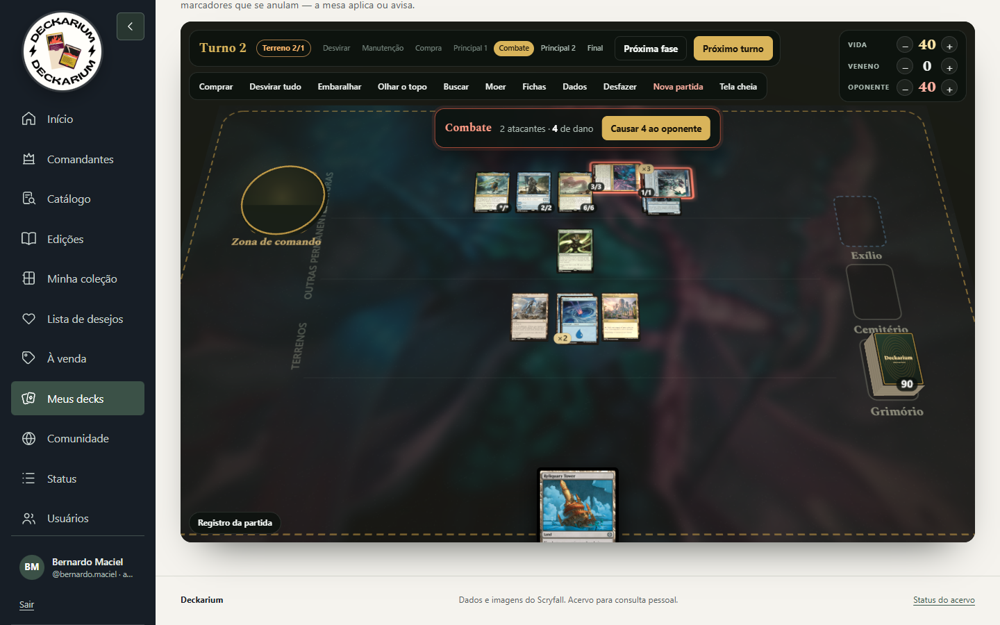

# Deckarium — oficina de decks

Acesse `http://localhost:8080/decks.php` ou **Meus decks** no menu. O módulo funciona no PHP/PostgreSQL existente e mantém os dados externos de recomendação em cache.

## Fluxo

1. Em **Minha coleção**, envie um CSV (`Name`, `Scryfall ID`, `Quantity` e, opcional, `Foil`) para **substituir**, **somar** ou **subtrair** cópias (vendas e trocas). Ao substituir, qualquer linha com erro cancela tudo; ao somar ou subtrair, as linhas corretas são aplicadas. Em todos os casos a página lista cada linha que não entrou com número, carta, motivo e conteúdo, e oferece essas linhas em CSV para corrigir e reenviar. Subtrair mais cópias do que a coleção tem, ou uma impressão/acabamento que não está nela, é erro daquela linha. Impressões desconhecidas do catálogo continuam aceitas ao importar e são sinalizadas.
2. Em **Meus decks**, a lista dos seus decks ocupa a página; **Novo deck** e **Importar lista** abrem em janelas. A importação tem um campo próprio para a **comandante** (aceita `Nome`, `1 Nome` ou `1 Nome (SET) 123`) e outro para o **restante do deck**. Se o campo da comandante ficar vazio, vale a carta sob o cabeçalho `Commander` da lista (exportações do Moxfield funcionam como estão); se a comandante aparecer também na lista, ela não é duplicada. Uma comandante inexistente ou inelegível gera erro antes de criar o deck, e a janela reabre com o que foi colado. A importação escolhe primeiro a impressão exata presente na coleção.
3. Ao criar um deck, escolha imediatamente uma comandante na lista. A mesma busca e os mesmos filtros usados depois para explorar o catálogo já funcionam nessa etapa; apenas a ordenação por sinergia fica indisponível até existir uma comandante de referência.
4. Depois da escolha, registre a estratégia e busque palavras ou frases literais do Oracle em inglês, separadas por ponto e vírgula: `sacrifice; land; graveyard`. **Todos os termos** usa AND; **Qualquer termo** usa OR. Ambas as faces são pesquisadas. Combine nome, tipo, disponibilidade, identidade de cor, raridade, edição e custo no mesmo painel.
5. Adicione cartas às candidatas e aprove-as para o deck (ou devolva-as às candidatas). Você define quantidade, função e observações. A edição expandida mostra imagem, tipo, custo e texto Oracle.
6. A lista é finalizada automaticamente quando comandante + cartas aprovadas chegam a 100 cartas. Cada troca é planejada dentro da seleção, relacionando uma carta do deck com qualquer impressão do catálogo e indicando quando ela está disponível na coleção.
7. Em **Minha seleção › No deck**, a seção **Análise do deck** (abaixo das cartas) mostra cartas/100, terrenos, valor estimado, símbolos de mana, alertas, curva de mana, cores dos custos, funções informadas, sugestão de terrenos e as exportações: texto, JSON completo e CSV no padrão da Liga (deck completo ou só o que falta).

   No CSV da Liga há ainda a escolha da **impressão**. O catálogo deles não tem promos (PDFT, PBLB, PLCI), The List, Secret Lair nem a numeração alta de produtos como o Jumpstart de Foundations, e uma linha assim faz a importação recusar a carta inteira. Por isso o padrão é **compatível com a Liga**: a mesma carta sai numa edição comum, pelo número base dela e no menor preço. As outras opções são **a mesma impressão do deck**, útil quando você quer exatamente aquela versão, e **sem edição**, que deixa a Liga escolher.

## Minha seleção: visualizações, fichas e terrenos automáticos

**Visualizações** (botões acima das cartas; a escolha fica lembrada no navegador, chave `deckarium:selection-layout`):

- **Por tipo:** os grupos recolhíveis de sempre.
- **Cartas grandes:** todos os tipos abertos, sem recolher, com as cartas em tamanho de leitura.
- **Cartas grandes** não cobre a arte: quantidade, GC, relações e situação na coleção ficam logo abaixo de cada carta.
- **Mapa de jogo:** uma matriz **função × valor de mana**. Cada linha é o que a carta faz (Comandante, Ramp, Compra, Remoção pontual, Remoção em massa, Proteção, Recursão, Tutores, Plano de jogo) e cada coluna é quando ela chega à mesa (0–1 até 7+). As cartas ficam em pilhas, como na mesa; passar o mouse levanta a carta e clicar abre a mesma janela da carta. No deck, cada linha mostra cartas/meta da comandante (com “faltam N”) e cada coluna mostra cartas/meta da curva. A função vem do campo “Função” da carta ou, se vazio, da leitura do Oracle (`deckScoreProfile`). Abaixo, a faixa **Base de mana** abre os terrenos em leque e conta as fontes de cada cor contra os símbolos dos custos. Arquivo: `deck_map_view.php`.


**Fichas e marcadores** (aba No deck, abaixo das cartas): calculados automaticamente de `raw.all_parts` (componente `token`) da comandante e das cartas aprovadas, agrupados pela identidade Oracle da ficha — fichas de criatura, Tesouros/Comida/etc., emblemas e marcadores (Monarca, Iniciativa). Cartas que criam cópias (texto “token that's a copy”, populate, myriad, encore…) geram a entrada “Cópia de uma permanente”. Cada ficha mostra quais cartas a criam, quantas já estão na coleção e uma sugestão de quantas ter à mão (soma do que cada carta cria de uma vez; X conta 3). Arquivos: `deck_tokens.php` e `deck_tokens_view.php`.


**Completar com terrenos** (botão na barra da aba No deck): você cuida das mágicas e o Deckarium monta a base de mana (`deck_lands.php`).

1. **Quantidade:** a janela mostra a **sugestão pelo deck** (`deckLandSuggestion`): parte de 37 terrenos com curva média 3,00 e ajusta ≈4 terrenos por ponto de curva média, −1 a cada 3 peças de aceleração até 3 manas (rochas e criaturas que geram mana e busca de terrenos valem 1; Tesouros avulsos, ½), −1 a cada 5 compras até 2 manas (até −2), +2 se o deck aproveita terrenos entrando e ±1 pelo custo da comandante, limitado a 31–42. Cada ajuste aparece com o motivo; a média do EDHREC fica como referência. A meta informada fica salva no deck (`scoring_config.land_fill`); vazia, vale a sugestão.
   **Regra:** os terrenos só são escolhidos quando a parte não terreno está fechada — comandante + mágicas = 100 − meta (terrenos que você aprovou contam na meta e nunca são trocados). Assim as cores e os não básicos são calculados sobre a lista final. Enquanto isso a janela diz quantas mágicas faltam ou sobram.
2. **Demanda de cor:** símbolos nos custos das mágicas do deck; os da comandante valem o dobro.
3. **Não básicos:** primeiro terrenos que já estão nas candidatas, depois os da coleção **com cópia livre** (fora de outros decks). Cada um é pontuado por cores úteis (ponderadas pela demanda; terrenos que buscam básicos contam como as cores que podem trazer), entrar virado, desvantagens (devolver terreno, filtrar mana, sacrificar terrenos = descartado), utilidade extra, popularidade e sinergia EDHREC com a comandante. Há teto de não básicos (30% em mono, 60% em duas cores, 85% em três ou mais), mínimo de básicos para cartas que buscam básicos e teto de terrenos só incolores. “Incluir terrenos fora da coleção” amplia para os mais jogados do catálogo, marcados como compra.
4. **Básicos:** completam o restante, divididos pela falta de fontes de cada cor em relação à participação dela nos custos, usando a impressão da coleção com mais cópias.

A janela mostra o plano antes de aplicar: demanda × fontes por cor, cada não básico com motivo e disponibilidade (desmarque e clique em Recalcular para trocar pela próxima opção) e os básicos com cópias livres. Os terrenos entram com a função **“Terreno automático”**: ao completar de novo (“Refazer terrenos”), só eles são recalculados; há também “Retirar os terrenos automáticos”. Ações de POST: `autofill_lands` e `clear_auto_lands`.

## Subpáginas do deck

Cada deck tem abas curtas em vez de uma página longa (`decks.php?deck=ID&view=…`):

| Aba | `view` | Conteúdo |
|---|---|---|
| Visão geral | `overview` (padrão) | Comandante, Minha intenção, compartilhamento (público/privado) e atalhos para as outras abas, inclusive **Análise do deck** |
| Guia da comandante | `guide` | Planos, combos, mecânicas e novidades |
| O que falta | `needs` | Metas por função e sugestões |
| Explorar | `explore` | Filtros e resultados, inclusive “Encaixa no deck” |
| Minha seleção | `selection` | Candidatas e deck; em **No deck**, a Análise do deck (`#deck-analysis`) |
| Quadro de relações | `deck_board.php` | Constelação 3D (ou plano) de quem fornece e quem aproveita, equilíbrio dos temas e sugestões da coleção |
| Mesa de teste | `deck_playtest.php` | Partida solitária numa mesa 3D: mulligan, terrenos, fichas, marcadores, combate e as regras que dá para conferir sozinho |

Links antigos com `view=discover` abrem a Visão geral, ou o Explorar quando trazem parâmetros de busca (`q`, `oracle`, `sort`, `page`…). Sem comandante, o deck mostra só a escolha da comandante e a seleção. As abas vêm de `deckSectionNav()`.

## Recomendações do EDHREC

O módulo é dividido em **Biblioteca**, **Comandante e descobertas** e **Minha seleção**. Na biblioteca, cada deck tem exclusão com confirmação, sem apagar cartas da coleção. A seleção tem duas abas: **Candidatas** (as cartas guardadas para comparar, com notas e aprovação — a antiga etapa “Em avaliação” foi unificada a ela e os itens antigos migram sozinhos) e **No deck**, ambas agrupadas por tipo. Mover uma carta entre etapas preserva quantidade, função e observações. Em qualquer aba, **Selecionar várias** ativa a seleção múltipla: clicar numa carta passa a marcá-la, cada tipo ganha “Marcar …” e a barra fixa oferece marcar todas, marcar as de nota Avançar e mover tudo de uma vez (candidatas → deck ou de volta). O servidor aplica as mesmas regras do mover individual na ordem da tela: cartas não básicas com mais de 1 cópia não entram no deck e, quando as vagas acabam, o restante fica onde estava com um aviso.

O painel de exploração combina todos os filtros e usa **Ordenar resultados** para alternar entre sinergia, relevância, nome, novidade e disponibilidade. **Disponibilidade** permite mostrar tudo, somente a coleção, **somente a coleção com cópia livre** (sobra ao menos uma cópia depois do que os outros decks usam) ou somente o que falta. Cada resultado mostra a situação da cópia: todas livres, quantas livres e em quais decks as outras estão (com link), ou que todas já estão em outros decks. Os resultados são paginados em grupos de 24 e deduplicados pela identidade Oracle. Outra impressão da mesma carta conta como propriedade e como seleção já existente. Quando possível, a impressão da coleção é mostrada; fora dela, uma impressão física tem preferência. Cada resultado permite adicionar a carta às candidatas.

Com um comandante definido, as recomendações do EDHREC são buscadas **automaticamente** na primeira visita ao deck quando ainda não há nenhuma para aquela comandante (depois de escolhê-la, importar uma lista ou abrir um deck antigo; leva cerca de 3 s, uma única vez). Se o EDHREC falhar, a página abre normalmente e uma nova tentativa só acontece após 6 horas (marcador em `storage/edhrec-misses/`). O botão **Atualizar** do guia continua disponível e grava métrica, fonte e data no cache local. O sistema preserva se o valor recebido é `synergy` ou `lift`, pois as escalas não são equivalentes. Esses números representam associação e popularidade entre listas, não uma avaliação objetiva de força. Se a rede ou o EDHREC estiver indisponível, a cache anterior é preservada e o restante do construtor continua funcionando.

Além da ordenação por sinergia, o painel apresenta planos prováveis para o comandante (sacrifício, fichas, cemitério, ramp, blink, Voltron, controle e tribal), com cartas específicas filtradas pela identidade e pela coleção. Combos compatíveis conhecidos são mostrados quando todas as peças existem no catálogo, com indicação de quais estão disponíveis. O selo **GC** identifica a lista curada local de Game Changers e aparece na exploração, nos pacotes, nos combos e na seleção.

## Limites desta versão

**Tipo de carta** (Criatura, Instantânea, Feitiço, Artefato, Encantamento, Planeswalker, Terreno) filtra pelo tipo impresso em qualquer face; marcar vários mostra cartas de qualquer um deles, e o filtro é preservado ao adicionar candidatas e ao paginar. **Tipos e temas** aceita vários termos separados por ponto e vírgula, com correspondência em qualquer um deles no tipo ou no Oracle. Por exemplo, `pirate; assassin; vehicle; treasure` encontra esses tipos e cartas que mencionam esses temas, incluindo criação de Tesouros. Esse grupo é combinado com os filtros de Oracle, coleção e identidade. Para consultar suas impressões e quantidades fora de um deck, use **Minha coleção** no menu.

- Um comandante por deck; parceiros e Backgrounds ainda não são modelados.
- A busca local é textual e explicada pelos termos encontrados. As recomendações externas não interpretam a estratégia escrita.
- Funções são classificações manuais. “Completar com terrenos” usa uma heurística (metas, símbolos e texto dos terrenos), não uma simulação de partidas; revise o plano antes de aplicar.
- Há alertas básicos de identidade e duplicidade, sem validação completa de legalidade ou banimentos.
- Cópias usadas em outros decks são **mostradas** (Explorar, Minha coleção, indicadores da seleção), mas não bloqueiam a adição; candidatas não reservam cópias. Preços do CSV não são usados como cotação atual.
- Preços são os valores USD/EUR da impressão no Scryfall convertidos para BRL. A conversão usa \`USD_BRL_RATE\` (padrão 5,50) ou \`EUR_BRL_RATE\` (padrão 6,00), configuráveis no ambiente do app; “Preço indisponível” significa que aquela impressão não possui cotação.

A seleção de comandantes considera a face frontal e inclui as criaturas lendárias, permissões explícitas no Oracle e veículos/espaçonaves lendários com poder e resistência, conforme o [boletim oficial de Edge of Eternities](https://magic.wizards.com/en/news/announcements/edge-of-eternities-update-bulletin).

## Guia da comandante

Ao escolher uma comandante, o Deckarium consulta o EDHREC (se a cache tiver mais de 7 dias) e mostra um guia com quatro abas:

- **Planos de jogo:** temas mais jogados com a comandante e quantos decks os usam, completados pela leitura local do texto Oracle. Cada plano mostra cartas do catálogo na identidade, quantas estão na coleção e um atalho para explorar o plano.
- **Combos:** combos populares do EDHREC/Commander Spellbook compatíveis com a identidade de cor, com resultado, pré-requisitos, passo a passo, uso em decks e bracket; em seguida, os combos do catálogo interno.
- **Mecânicas:** habilidades da própria comandante e mecânicas lançadas nos últimos 24 meses que têm cartas na identidade, com explicação em português e o texto de lembrete do Oracle.
- **Novidades:** cartas novas que já aparecem nas listas da comandante (com botão para adicionar às candidatas) e comandantes parecidas.

Os dados ficam em `deck_commander_insights` e são atualizados pelo botão “Atualizar” do guia. `EDHREC_JSON_BASE` permite apontar para outro endereço em testes. Na busca, “Somente identidade da comandante” vem marcado por padrão depois que a comandante é escolhida.

## Índice de Encaixe (histórico)

> A nota foi substituída pelas relações explicáveis acima; as metas e regras continuam em uso.

Na versão anterior, cada carta recebia uma nota de 0 a 100 (`app/deck_scoring.php`):

`nota = 100 × regras × Σ(peso × componente) ÷ Σ(pesos) + bônus`

- **Encaixe com a comandante / Conexões com o deck:** o texto Oracle vira características "produz" (cria Tesouro, sacrifica, põe +1/+1…) e "se importa com" (sempre que uma criatura morrer, Piratas que você controla…). A pontuação soma os pares produz×procura nos dois sentidos, tribos (mais raras valem mais), palavras-chave e termos raros em comum (raridade calculada sobre o catálogo).
- **Função que falta:** ramp, compra, remoção pontual, remoção em massa, proteção, recursão, tutores, terrenos e plano de jogo, comparados com as metas do deck (só cartas no deck contam; as candidatas com a função são mostradas à parte).
- **Curva, exigência de cor** (para terrenos: cores da identidade que produzem e se entram virados), **intenção** (termos de "Minha intenção"), **EDHREC** (sinergia, inclusão, popularidade), **coleção** e **orçamento**.
- **Cartas de função** (terrenos, ramp, compra, remoção…) não dependem de sinergia: o peso dela cai e o da função e do EDHREC sobe, voltando ao normal quanto mais sinergia a carta tiver.
- **Regras:** fora da identidade, banida ou cópia repetida = bloqueada. Conforme o bracket: Game Changers (0 nos brackets 1–2, até 3 no 3), destruição de terrenos em massa (só bracket 4+), turnos extras e combos infinitos de duas cartas viram multiplicadores; combos conhecidos dão bônus.
- **Faixas:** Avançar (70+), Avaliar (45+), Segurar, Bloqueada — limites configuráveis.

"Ajustar fórmula" abre presets (Equilibrado, Sinergia primeiro, Base sólida, Coleção e orçamento, Otimizado), pesos, metas de função e curva, bracket, preço máximo e limites, com prévia ao vivo. A configuração fica em `builder_decks.scoring_config`. "Aplicar sugestões" aprova para o deck as candidatas com nota de avanço, até as vagas abertas e respeitando o limite de Game Changers.

## O que o deck precisa

Em **Comandante e descobertas**, logo após o guia, o painel compara as cartas aprovadas com as metas de função da fórmula (terrenos, ramp, compra, remoção pontual, remoção em massa, proteção, recursão, tutores). Cada função mostra quanto falta, quantas candidatas já a cumprem e seis cartas do catálogo na identidade da comandante que ainda não estão na seleção — primeiro por sinergia EDHREC, depois pela popularidade — com botão de adicionar. “Ver todas” abre o Explorar com o filtro **Função no deck**. O índice de funções (`deckNeedRoleIndex`, mesmas regex do Índice de Encaixe rodando no PostgreSQL) é gerado uma vez por sincronização do catálogo (~5 s) e aquecido ao escolher a comandante. Na Minha seleção fica só um link para esse painel.

## Relações entre cartas

As relações (`app/deck_relations.php`) são setas **A → B**: a carta A *fornece* algo e a carta B *aproveita*. Cada relação traz o motivo em português e o trecho do texto Oracle das duas cartas.

- **Texto Oracle, frase por frase** (sem lembretes; o nome da carta e “this creature” viram `~`): Tesouros, Comida, Pistas, Sangue, fichas de criatura, mesa larga, sacrifício (corpos × saídas), mortes, marcadores +1/+1 e -1/-1, proliferar, efeitos de entrada e blink, criaturas entrando, explorar, terrenos entrando, cemitério, descarte, instantâneas/feitiços, mágicas não criatura, artefatos, encantamentos, equipamentos/Auras, lendárias, ataques, ganho e perda de vida, compra, cartas dos oponentes, goad, energia, veneno e cópias.
- **Fichas criadas** (`raw.all_parts` do Scryfall), inclusive o tipo da ficha (ex.: ficha de Merfolk). Fichas que vão para o oponente (Beast Within, Ravenform) não contam.
- **Tribos:** tipos de criatura da carta, changeling e menções no texto (“Other Merfolk you control…”). Cartas “escolha um tipo de criatura” usam a tribo principal do deck (a da comandante tem prioridade).
- **Tags do Scryfall Tagger** (opcional): `php bin/sync_tagger.php` grava em `card_tags` as tags de função usadas (`deckRelationTagMap()`); elas só completam o que o texto não detectou e aparecem marcadas como “Scryfall Tagger”.
- **Combos:** combos do EDHREC (guia da comandante) e do Commander Spellbook com todas as peças presentes viram setas tracejadas.

Na Minha seleção, o diálogo de cada carta lista as relações com o deck e com as candidatas nesse formato.

## Quadro de relações


`deck_board.php?deck=ID` (aba **Quadro de relações** do deck) mostra **só a comandante e as cartas aprovadas no deck**; candidatas ficam de fora para o quadro continuar leve. O quadro ocupa toda a largura da página; o painel de detalhes flutua à direita e pode ser recolhido (**Ocultar painel**), e **Tela cheia** usa a tela inteira (ou a janela inteira, quando o navegador não permite).

Há duas vistas, com os mesmos filtros, foco e painel (a escolha fica lembrada no navegador):

- **Constelação 3D** (padrão, `assets/board3d.js`, three.js de `assets/vendor`): as cartas flutuam sobre um tapete de jogo escuro. A comandante fica no centro, maior e com brilho dourado; cada tema (o grupo de relação em que a carta mais se liga) é um território em volta dela, com o nome impresso no tapete e as cartas mais conectadas no miolo. Arcos coloridos ligam quem **fornece** a quem **aproveita**, e faíscas correm nesse sentido; uma ponta de seta marca o destino. Os nós de tema (“Agrupar por tema”) são esferas com uma placa `fornecem → aproveitam`.
  - Arrastar gira; botão direito ou Shift + arrastar move; roda do mouse (ou pinça no celular) aproxima. Clicar numa carta a coloca em foco: a câmera voa até ela e as vizinhas, o resto escurece. Passar o mouse mostra o nome e acende as linhas da carta.
  - As miniaturas carregam primeiro; a imagem normal é trocada quando a carta fica grande na tela. A constelação gira devagar quando ninguém mexe (desligável em **Exibição**) e para com `prefers-reduced-motion`. O módulo só é baixado quando a vista 3D é aberta; sem WebGL, o quadro volta para o plano.
- **Plano** (SVG): blocos por tema com as cartas em grade, primeiro as que mais **fornecem** e depois as que mais **aproveitam**. Setas sob demanda (**Todas as setas no plano** exibe todas em tom suave), cartas arrastáveis (posições lembradas; chave `deckarium-board-v2-<deck>`) e **Reorganizar**.

Nas duas vistas:

- **Foco:** clique para ver no painel o que a carta **fornece para** e **aproveita de** cada carta, com os trechos do texto. `?focus=<id>` abre com a carta em foco (link no diálogo da seleção, só para cartas do deck). Passar o mouse num nome do painel acende a carta no palco.
- **Exibição:** **Agrupar por tema** (uma relação repetida 7 vezes ou mais passa por um nó do tema), **Agrupar terrenos** (terrenos que só fornecem “terrenos entrando” viram um bloco), **Mostrar cartas sem relação**. Filtros por grupo de relação e busca de carta.
- **Equilíbrio dos temas** (painel, `boardBalance()`): para cada característica do deck, quantas cartas fornecem e quantas aproveitam, numa barra dupla. Pontas soltas vêm primeiro — **Falta fonte** (alguém aproveita e ninguém fornece), **Fonte única** (uma carta sustenta duas ou mais) e **Sem retorno** (três ou mais fornecem e ninguém aproveita; não vale para o que vem do próprio tipo da carta, como ser artefato ou terreno) — e depois os **Motores**. Clicar num tema destaca as cartas e linhas dele.
- **Sem relação:** cartas do deck (fora terrenos) que não fornecem nem aproveitam nada das outras — em geral remoção e compra genéricas, ou as primeiras a sair num upgrade.
- **Sugestões da coleção:** o botão pede ao servidor (`POST action=suggest`, `boardSuggestions()`) as 14 cartas da sua coleção — na identidade da comandante, legais no Commander, fora da seleção — que mais se ligariam ao deck, pela mesma conta do “Encaixa no deck” (`deckRelationPreview`). Elas aparecem translúcidas numa órbita externa (ou num bloco próprio no plano), com linhas discretas até serem focadas; o painel mostra as relações e o botão **Adicionar às candidatas**.
- **Combos no Commander Spellbook:** botão no painel consulta o *Find My Combos* (`SPELLBOOK_API_BASE`, padrão `https://backend.commanderspellbook.com`) e guarda o resultado em `deck_spellbook_cache`. Combos completos viram linhas; os que “faltam 1 carta” mostram se você tem a peça na coleção.
- Assets próprios: `assets/board.js` (grafo, painel e plano), `assets/board3d.js` (constelação) e `assets/board.css`.

## Mesa de teste



`deck_playtest.php?deck=ID` (aba **Mesa de teste** do deck) é uma partida solitária e manual com a comandante e as cartas aprovadas no deck, numa mesa 3D. Candidatas ficam de fora. Os dados vêm do servidor (`playtestCard()`: face da frente e de trás, P/R, lealdade, cores, ímpeto; `deckTokenList()` para as fichas); a partida roda no navegador (`assets/playtest.js`) e o desenho em `assets/playtest-scene.js`, com o three.js de `assets/vendor`.

**A mesa.** O tapete é a ilustração da comandante, desfocada e escurecida, com as zonas impressas: fileiras de criaturas, outras permanentes e terrenos no centro; grimório, cemitério e exílio em pilhas à direita (a altura acompanha a quantidade; o cemitério e o exílio mostram a carta de cima); a comandante em pé num pedestal dourado à esquerda. As cartas têm espessura e sombra de verdade, flutuam quando o mouse passa e se inclinam quando arrastadas. Arrastar o fundo gira um pouco a mesa, a roda do mouse aproxima e o duplo clique volta à vista inicial.

**Como jogar.**

- **Mão:** em leque na borda de baixo. Duplo clique (ou Enter) joga a carta numa vaga da fileira certa; arrastar solta onde quiser — na mesa, no cemitério, no exílio ou no grimório; um clique abre o menu (lançar, jogar virada para baixo, descartar, exilar, topo ou fundo do grimório).
- **Campo:** clique vira/desvira; o botão direito abre o menu (marcadores, transformar dupla face, virar a face para baixo, criar cópia, mover para qualquer zona, abrir a página da carta). Com o mouse sobre a carta: **T** vira, **A** ataca, **C** marcadores, **+**/**−** +1/+1, **G** cemitério, **E** exílio, **H** mão. Arrastar reposiciona; soltar numa pilha muda de zona. Terrenos básicos iguais e fichas iguais se empilham com um selo “×N”.
- **Pilhas:** clicar no grimório compra; o botão direito embaralha, olha o topo, busca, mói, exila ou revela o topo. Cemitério e exílio abrem a lista com os destinos de cada carta. Clicar no pedestal lança a comandante.
- **Barra de cima:** turno e fases (**Próxima fase**, Espaço; **Próximo turno**, N — desvira tudo, manutenção e compra), vida, veneno e um **oponente imaginário** de 40 vidas. Ferramentas: comprar (D), desvirar tudo (U), embaralhar (S), olhar o topo (X — vidência, vigiar, “olhe N”: cada carta vai para topo, fundo, cemitério, mão ou exílio, com a ordem ajustável), buscar (F — embaralha ao fechar), moer (M), fichas (K — as que as cartas do deck criam, com a arte da impressão, ou uma personalizada), dados e moeda, desfazer (Ctrl+Z, até 80 passos), nova partida e tela cheia.
- **Registro da partida:** tudo o que aconteceu, por turno.

**Regras que a mesa aplica ou avisa** (com o número da regra nas Comprehensive Rules):

- Mulligan de Londres com o primeiro grátis do multiplayer: compra 7 de novo e, ao manter, escolhe na mão as cartas que vão para o fundo (103.5). Em Commander ninguém pula a compra do 1º turno; “Partida a dois” em **Nova partida** faz quem começa pular (103.8a).
- Um terreno por turno: o selo “Terreno 0/1” muda de cor e o segundo gera aviso (305.2).
- Enjoo de invocação: criatura que entrou no turno (sem ímpeto) ganha um anel pulsante e um aviso ao virar ou atacar (302.6).
- Combate: na fase de combate, clicar numa criatura declara o ataque (vira, exceto com vigilância); a barra soma a força dos atacantes e **Causar N ao oponente** tira a vida do oponente imaginário. Quando ele chega a 0, a mesa comemora e guarda o turno (“caiu no T5”) — um jeito rápido de medir a velocidade do deck.
- Imposto do comandante: cada lançamento da zona de comando soma {2} ao próximo, mostrado no pedestal (903.8). Se a comandante iria para cemitério, exílio, mão ou grimório, a mesa pergunta se ela vai para a zona de comando (903.9).
- Ao sair do campo, a carta perde marcadores e volta desvirada (400.7); fichas deixam de existir fora do campo (704.5d).
- Verificações de estado: marcadores +1/+1 e −1/−1 se anulam (704.5q); criatura com resistência 0 ou menos vai para o cemitério (704.5f); planeswalker sem lealdade também (704.5i) — ele entra com a lealdade impressa; comprar de grimório vazio, 10 venenos ou vida 0 geram aviso de derrota (704.5b, 704.5c, 704.5a). Na limpeza, mais de 7 cartas na mão gera aviso de descarte (514.1).

**Efeitos.** Cada carta que entra no campo solta faíscas nas cores dela (terrenos: nas cores de mana que produzem) e ondas no tapete; a comandante sobe do pedestal com partículas douradas; o exílio dissolve a carta em luz azulada; o cemitério deixa cinzas; fichas surgem num estalo; comprar faz uma carta voar do grimório para a mão, que recebe a carta deslizando; embaralhar sacode a pilha; marcadores viram fichas de pôquer empilhadas no canto da carta; atacantes brilham em vermelho e avançam; o dano ao oponente sobe em números. Com `prefers-reduced-motion`, as animações e partículas param.

A partida fica guardada no navegador (`localStorage`, chave `deckarium-playtest-v1-<deck>`) e é retomada ao voltar, desde que as cartas do deck não tenham mudado. A mesa precisa de WebGL; sem ele, a página avisa.

## Metas automáticas por comandante

As metas de função (terrenos, ramp, compra, remoções, proteção, recursão, tutores) e a curva são calculadas para a comandante (`deckDynamicTargets()`):

1. **Com dados do EDHREC:** média de terrenos e curva média das listas; para cada função, a soma das taxas de inclusão (decks com a carta ÷ decks possíveis) das cartas listadas, calibrada para 99 cartas e limitada a faixas razoáveis. Os valores são gravados em `deck_commander_insights.payload.role_estimates` ao atualizar o EDHREC (versão 3 do guia).
2. **Sem EDHREC:** base comum ajustada pela leitura da comandante (custo alto → mais ramp; landfall → mais terrenos; mágicas → mais compra; cemitério/mortes → mais recursão; ataques/equipamentos → mais proteção; fichas → menos remoção em massa).

Em “Ajustar metas e regras”, **Automáticas** é o padrão (`scoring_config.targets_mode = auto`); editar um número passa para **Personalizadas**, e “Restaurar padrão” volta ao automático.

## Explorar: Encaixa no deck e ocultar selecionadas

- **Ocultar cartas já no deck ou nas candidatas** vem marcado com comandante (`hide_selected`).
- **Ordenar por → Encaixa no deck (coleção)** (`sort=fit`): só cartas da sua coleção, na identidade, legais no Commander e fora da seleção. Cada resultado mostra com quantas cartas da seleção se liga e, ao abrir, os motivos com os trechos — antes de adicionar às candidatas. A ordem é pelo peso das relações (relações com a comandante valem mais).

## Exportação JSON

“Exportar deck em JSON (completo)” (`?export=json`) baixa `deckarium-<deck>-<id>.json` com o deck (estratégia, contagens, curva, símbolos, alertas, lista de compras), a fórmula e as metas, a comandante e todas as cartas do deck e das candidatas. Cada carta traz etapa, quantidade, função e notas; coleção (total, esta impressão, normal/foil, uso em outros decks, faltando); preço em R$; Game Changer; imagens; sinergia EDHREC; Índice de Encaixe com a decomposição; e o registro completo do Scryfall (`scryfall.raw`). Upgrades pendentes vão em `upgrades`.

## Minha coleção: uso em decks e exportação

- **Filtro de uso:** “Usadas em decks”, “Fora de qualquer deck” e “Com cópia livre”. O cálculo considera todas as impressões da mesma carta lógica e as cópias usadas por cartas aprovadas e comandantes de todos os seus decks.
- Cada carta da coleção mostra “Fora de decks” ou quantas cópias estão livres e em quais decks as outras estão.
- **Exportar (CSV)** baixa o resultado com os filtros ativos (busca, acabamento, uso, ordenação). As quatro primeiras colunas (`Name`, `Scryfall ID`, `Quantity`, `Foil`) são as da importação, então o arquivo pode ser reimportado; seguem edição, código, número, idioma, raridade, cópias da carta na coleção, cópias em decks e os nomes dos decks.

## Perfil público

Todo usuário ativo tem um perfil em `/profile.php?u=<usuario>` (link a partir da Comunidade, que lista os jogadores, e do autor de cada deck público). Em **Minha conta › Perfil público** cada um edita, com prévia ao vivo: nome de exibição, bio, local, site, cores favoritas, foto de perfil e capa — imagem enviada ou a ilustração (`art_crop`) de uma carta — com enquadramento vertical. Imagens: JPEG, PNG ou WebP até 2 MB; o servidor remove EXIF/XMP (localização e dados da câmera) e grava em `storage/profiles/<id>/` (`profile_lib.php`, `profile_image.php`). O perfil mostra só os decks públicos e a coleção se ela for pública; nome completo e email nunca aparecem.

## Compartilhamento público

- **Deck:** na Visão geral, o painel **Compartilhar** torna o deck público ou privado e oferece o link (`/public_deck.php?id=ID`). Decks públicos ganham o selo “Público” na lista.
- **Coleção:** em Minha coleção, **Tornar pública** libera `/public_collection.php?u=<usuario>`.
- **Comunidade** (`/public.php`, no menu) lista os decks e coleções públicos, com busca por nome do deck ou da comandante; `?u=<usuario>` filtra por usuário.
- As páginas públicas são somente leitura e abrem sem login. O deck mostra comandante, intenção, curva e as cartas aprovadas por tipo, com download da lista em `.txt`. A coleção mostra cartas, quantidades, edição, idioma e foil, com busca.
- Nunca são expostos: nome completo, email, candidatas, funções e notas das cartas, preços e em quais decks as cartas estão. Decks e coleções privados (ou de contas desativadas) respondem 404; o próprio dono vê uma pré-visualização marcada.

## Persistência e teste

As tabelas `builder_decks`, `builder_items`, `builder_collection`, `deck_upgrades`, `deck_synergy` e `deck_commander_insights` (e as colunas `builder_decks.is_public` e `users.collection_public`) são criadas automaticamente na primeira abertura. A descrição de cada tabela e coluna está no [dicionário de dados](banco-de-dados.md). Faça backup delas junto com o banco. Importar a coleção não modifica o catálogo Scryfall.

Com o app em execução e a coleção de exemplo importada:

```powershell
node tests/deck-workflow.mjs
node tests/upgrades-workflow.mjs
node tests/deck-synergy-workflow.mjs
```

Os testes HTTP criam e removem seus próprios decks temporários. Eles verificam comandante, Oracle AND/OR, filtros, etapas, quantidades, exportação, compras, importação textual, escolha da impressão da coleção, registro de upgrade e CSRF. Para importar explicitamente um CSV completo antes do primeiro teste, passe seu caminho como argumento; isso substitui a coleção atual.

O teste de sinergia requer recomendações de Edward Kenway já atualizadas no cache local; ele não chama o EDHREC nem altera a coleção.
