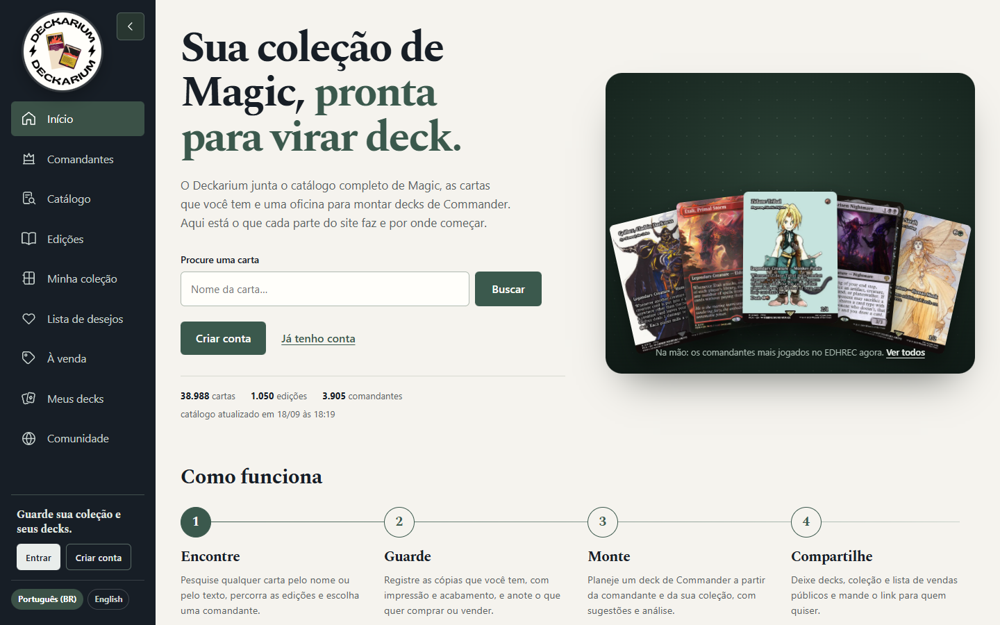

# Página inicial

`/` sem busca nem filtros abre a página inicial (`app/home.php`, incluída por `app/index.php`). Ela explica o que é o Deckarium, como as partes se encaixam e o que cada módulo faz, com links para todos eles. O item **Início** é o primeiro do menu e a marca do Deckarium leva de volta para cá. Qualquer busca ou filtro (`q`, `set`, `catalog`, `view`, `page`, `sort`…) continua abrindo o catálogo na mesma rota.



## Seções

1. **Abertura:** título, resumo do site, busca de carta (envia `q` para o catálogo) e dois atalhos — para visitantes, **Criar conta** e **Já tenho conta**; com login, **Abrir meus decks** e **Minha coleção**. Abaixo, os números reais do acervo: cartas únicas, edições, comandantes, a sua coleção e os seus decks (com login) e a hora da última importação do catálogo.
2. **A mão:** os cinco comandantes mais jogados no EDHREC (`edhrec_rank_cached`), em leque sobre um tapete escuro — o mesmo da constelação 3D do quadro de relações. Cada carta abre a página dela; passar o mouse abre o leque e levanta a carta.
3. **Como funciona:** quatro passos, na ordem em que o site é usado — **Encontre**, **Guarde**, **Monte**, **Compartilhe**. Cada passo leva ao grupo de módulos correspondente.
4. **Módulos**, agrupados pelos mesmos passos. Cada um tem o ícone do menu, a quem está aberto (**Aberto a todos**, **Com conta**, **Administração**), o que faz e o que dá para fazer nele:
   - *Encontrar cartas:* Comandantes, Catálogo, Edições e a página da carta.
   - *Guardar o que você tem:* Minha coleção, Lista de desejos e À venda.
   - *Montar decks:* Meus decks, as sete abas de cada deck na ordem (Visão geral, Guia da comandante, O que falta, Explorar, Minha seleção, Quadro de relações, Mesa de teste) e um destaque do quadro de relações em 3D (`assets/home/quadro-constelacao.jpg`, captura de um deck real).
   - *Compartilhar:* Comunidade e Perfil e conta.
5. **De onde vêm os dados:** Scryfall, EDHREC, Commander Spellbook e Scryfall Tagger; a rotina automática das 06:10 e 18:10; o idioma do site. Administradores veem também os atalhos para Status, Histórico de atualizações e Usuários.

Todos os textos passam por `t()`/`te()` e têm tradução em `lang/en.php`.

## Dados e cache

As consultas usam `catalogCached` (chave inclui a revisão da sincronização): números do acervo por 6 horas (`home-stats-v1`), hora da última importação por 1 hora (`home-synced-v1`) e a mão de comandantes por 24 horas (`home-hand-v1`). Os comandantes seguem a regra da página Comandantes (sem cartas só digitais, fichas ou art series) e usam a impressão mais nova em inglês com imagem. Os números da sua coleção e dos seus decks são lidos a cada visita, só com login. Sem acervo sincronizado, a linha de números e a mão não aparecem; o resto da página continua.

## Acessibilidade e movimento

- A busca tem rótulo visível; cada grupo de módulos é uma região com título, e os passos são uma lista ordenada.
- As cartas da mão são links com o nome da carta no texto alternativo; o foco pelo teclado levanta a carta como o mouse.
- O leque flutua devagar; com `prefers-reduced-motion: reduce` fica parado e sem transições.
- Até 980px a abertura vira uma coluna e os títulos dos grupos deixam de acompanhar a rolagem; até 760px os passos ficam em duas colunas (uma abaixo de 420px) e o leque encolhe, sem rolagem horizontal.

## Verificação

Com a aplicação em `http://localhost:8080` e o acervo sincronizado:

```powershell
New-Item -ItemType Directory -Force .impeccable/review | Out-Null
node tests/home-smoke.cjs
```

O teste requer Node.js, Playwright e Google Chrome (aponte `NODE_PATH` para a pasta `node_modules` do Playwright, se preciso). Ele confere o item **Início** marcado no menu, os quatro passos e os quatro grupos de módulos, a mão de comandantes, a busca levando ao catálogo, o catálogo com 36 cartas e a ausência de rolagem horizontal a 390px, e salva capturas desktop e mobile em `.impeccable/review/`.

## Histórico

A inicial anterior tinha uma escultura 3D de dragão (`assets/dragon.js`, com a referência `assets/smaug-reference.png`) e uma prévia de seis cartas; depois `/` passou a redirecionar para Comandantes. Os arquivos da escultura continuam no projeto, mas nenhuma página os carrega.
